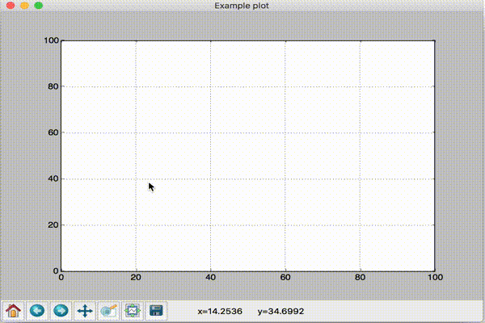

# Matplotlib draggable plot example



## Installation

```bash
$ pip install matplotlib
```

## Usage

```bash
$ python draggable_plot.py
```

- Left click to add new point
- Drag to move point
- Right click to remove point


# ドラッグ可能なプロットの例 (Matplotlib)

## 使い方

- 左クリックで点を追加
- 点をドラッグで移動
- 右クリックで点を削除
